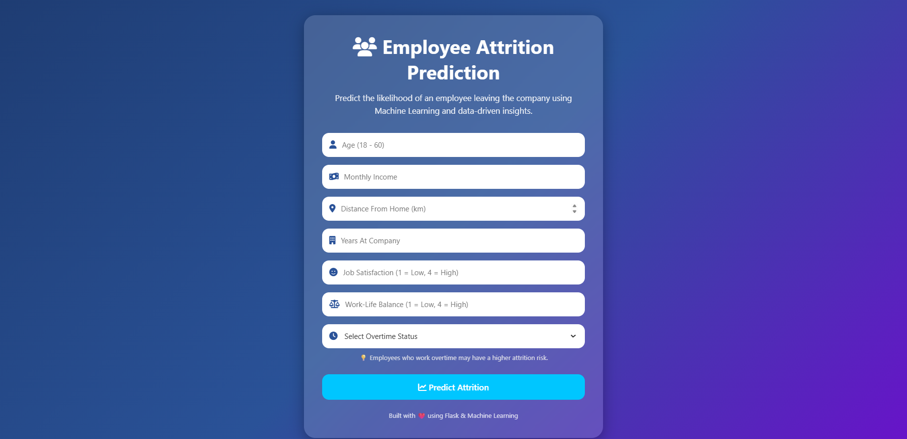
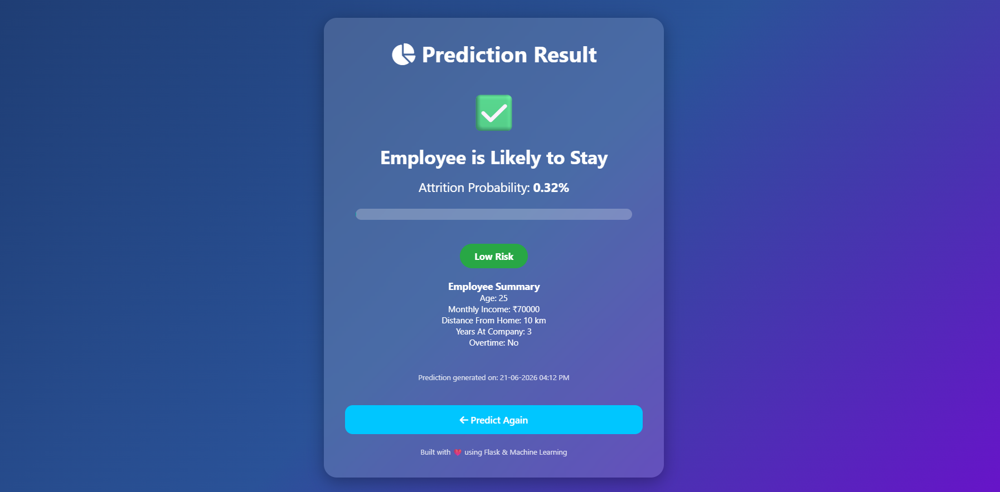

# Employee Attrition Prediction System

## Overview
The Employee Attrition Prediction System is an end-to-end Machine Learning web application that predicts whether an employee is likely to leave an organization based on HR analytics data. The application uses Machine Learning techniques and provides real-time predictions through a Flask web interface.

---

## Features

✅ Employee Attrition Prediction

✅ Attrition Probability Score

✅ Risk Classification (Low, Medium, High)

✅ Interactive Web Interface

✅ Responsive User Interface

✅ Real-Time Prediction System

✅ Machine Learning Model Integration

---

## Project Screenshots

### Home Page



### Prediction Result



---

## Tech Stack

### Frontend
- HTML5
- CSS3
- JavaScript
- Font Awesome

### Backend
- Flask
- Python

### Machine Learning
- Pandas
- NumPy
- Scikit-Learn
- Joblib

### Tools
- VS Code
- Google Colab
- Git
- GitHub
- Render

---

## Dataset

IBM HR Analytics Employee Attrition & Performance Dataset

Dataset Features:

- Age
- Monthly Income
- Distance From Home
- Job Satisfaction
- Work-Life Balance
- Overtime
- Years At Company
- Total Working Years
- Job Role
- Education
- Performance Rating
- And several other HR attributes.

---

## Machine Learning Workflow

1. Data Collection
2. Data Cleaning
3. Exploratory Data Analysis (EDA)
4. Label Encoding
5. Feature Scaling
6. Train-Test Split
7. Model Training
8. Model Evaluation
9. Model Serialization
10. Flask Deployment

---

## Model Used

### Logistic Regression

Why Logistic Regression?

- Simple and interpretable model
- Works well for binary classification problems
- Provides probability estimates
- Fast training and prediction

---

## Model Performance

| Metric | Value |
|--------|--------|
| Accuracy | 87.41% |
| F1 Score | 49.31% |
| Problem Type | Binary Classification |

---

## Folder Structure

```text
Employee-Attrition-Prediction
│
├── app
│   ├── app.py
│   ├── templates
│   │   ├── index.html
│   │   └── result.html
│   └── static
│       ├── css
│       │   └── style.css
│       ├── images
│       │   ├── home-page.png
│       │   └── result-page.png
│       └── js
│           └── script.js
│
├── dataset
│   └── WA_Fn-UseC_-HR-Employee-Attrition.csv
│
├── model
│   ├── attrition_model.pkl
│   ├── scaler.pkl
│   └── encoders.pkl
│
├── notebooks
│   └── Employee_Attrition_Prediction.ipynb
│
├── train_model.py
├── requirements.txt
├── runtime.txt
├── Procfile
├── README.md
└── .gitignore
```

---

## Installation

### Clone Repository

```bash
git clone https://github.com/your-username/Employee-Attrition-Prediction.git
```

### Move to Project Directory

```bash
cd Employee-Attrition-Prediction
```

### Install Dependencies

```bash
pip install -r requirements.txt
```

### Run Application

```bash
cd app
python app.py
```

### Open Browser

```text
http://127.0.0.1:5000
```

---

## Future Enhancements

- User Authentication System
- Database Integration
- Dashboard Analytics
- Employee Management Module
- Email Notifications
- Cloud Deployment
- Advanced Machine Learning Models

---

## Resume Highlights

- Developed an end-to-end Machine Learning web application using Flask and Scikit-Learn.
- Performed data preprocessing, feature engineering, and model training on IBM HR Analytics data.
- Implemented real-time employee attrition prediction with probability-based risk assessment.
- Built a responsive frontend using HTML, CSS, and JavaScript.
- Deployed a production-ready ML application structure using Git and Render.

---

## Author

**Mohammed Salman**

GitHub: https://github.com/MohammedSalman7

Live Project: https://employee-attrition-prediction.onrender.com

Machine Learning | Python | Full Stack Development | Data Analytics